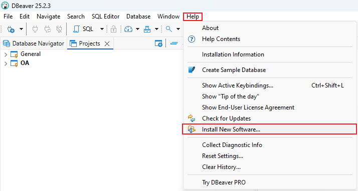
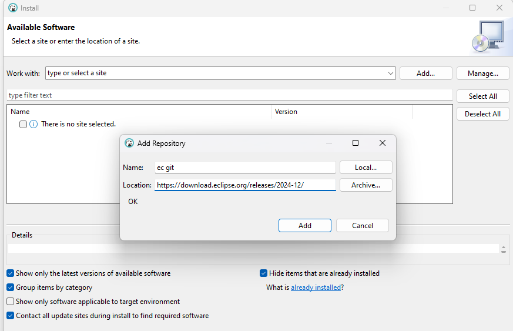
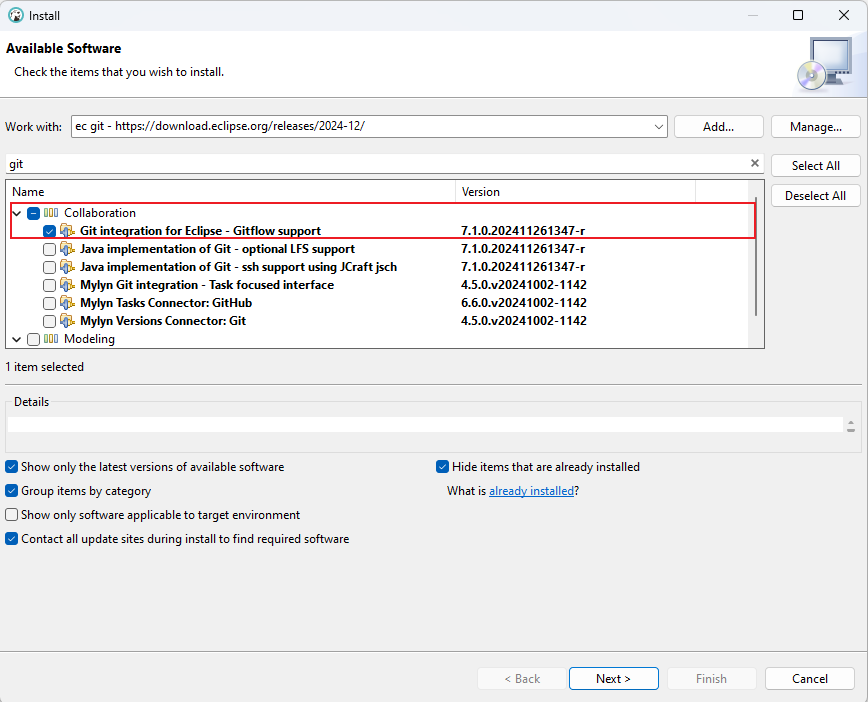
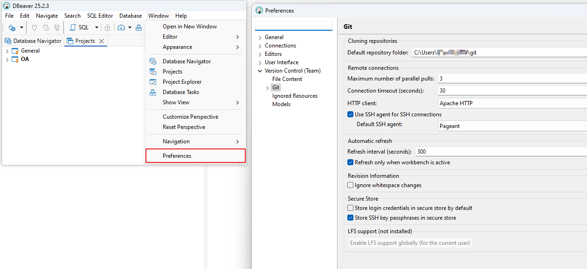

# Manage SQL with Git in DBeaver

## Introduction

* The guide benifits the person who likes to use DBeaver to execute SQL.
* The guide benifits the person who likes to Git in the area of version control.

## Environment

The following software should be installed:

* [DBeaver community version 25.2.3](https://dbeaver.io/download/)
* [Git 2.43 windows](https://git-scm.com/install/windows)

## Steps

### Step1: Install Git component in DBeaver

1. 打开 DBeaver → `Help → Install New Software`

   
2. 点击 `Add`，输入上述任一仓库地址（名称可自定义，如 `EGit Stable` 或 `Eclipse 2024-12`）

   
3. 加载完成后，搜索 `git`，勾选  **Git Integration for Eclipse** （核心组件，通常是第一个结果）

   
4. 取消勾选其他非必要组件（如文档、Mylyn 集成），减少依赖
5. 点击 `Next`，接受协议，完成安装并重启 DBeaver
6. 检查安装成功与否，成功会在 `Window → Perferences → Version Control → Git`,默认会加载已安装的Git配置

   
